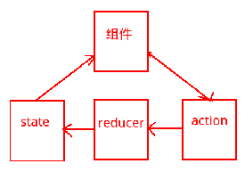

# react_redux_demo
##简介

react框架为我们理顺了 store --> view 的“单向”工作流（store是state的容器）；然后，redux框架为我们理顺了 view --> store 的“单向”工作流。并且react和redux都以组件化的形式可以将各自负责的功能进行灵活地组装或拆分，最大程度上确保我们“一次只需要专注于一个局部问题”

##redux结构
state就是数据，组件就是数据的呈现形式，action是动作，action是通过reducer来更新state的。
结构如下图

本项目通过结合react redux 编写简单实例，首先注册store 再通过connect方法将我们需要的state中的数据和actions中的方法绑定到props上

从组件的props属性中导入四个方法和一个变量

`const { addPrice, counter} = this.props`

调用props中的counter （combineReducers方法将所有reducer打包起来  再对其createStore 再由connect方法将state中的数据与actions中的方法绑定到props上）进行数据遍历

点击其button按键调用addPrice进行数据消息传递，即action-->reducer-->更新state-->ui更新

对组件进行安全限制

`demoComponents.propTypes = {

    //addPrice必须为fucntion,且必须存在
    
    addPrice: PropTypes.func.isRequired,
    
    counter必须为数组，且必须存在
    
    counter: PropTypes.arrayOf(PropTypes.shape({
    
        id: PropTypes.number.isRequired,
        
        title: PropTypes.string.isRequired,
        
        price: PropTypes.number.isRequired,
        
    })).isRequired,
};`

##使用 react-hot-loader

用 react 编写代码时，能让修改的部分自动刷新。但这和自动刷新网页是不同的，因为 hot-loader 并不会刷新网页，而仅仅是替换你修改的部分

需要：react-hot-loader、webpack-dev-server资源包 

安装命令：
   npm install --save-dev react-hot-loader
   
   npm install --save-dev webpack-dev-server
         
配置 webpack.config.js

修改 entry

    // 写在入口文件之前
    
    "webpack-dev-server/client?http://0.0.0.0:3000",
    
    "webpack/hot/only-dev-server",
    
    // 这里是你的入口文件
    
    "./src/app.js",
    
运行

   `node server.js`
   
##常用编译命令

根据package.json的内容进行安装相关资源包
     
    `npm install` 
     
webpack打包
     
    `webpack` 
     
